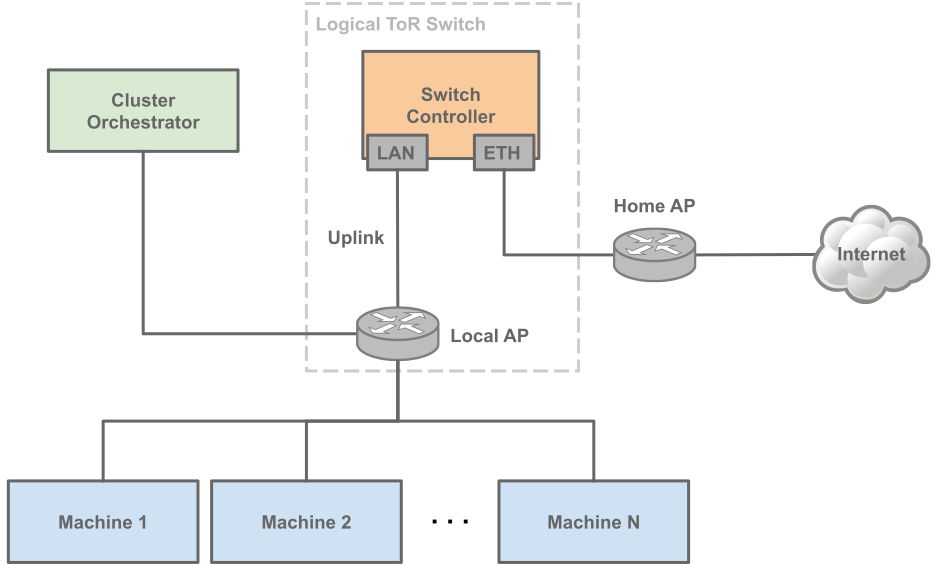

# hocla
Home Cluster - Simple implementation of; 

## Network Layout

| Component | Hardware Used  | OS | Note |   |
|---|---|---|---|---|
| Cluster Orchestrator | Raspberry Pi 4 B+ 8GB |  |   |   |
| Switch Controller | Orange Pi R1 Plus LTS | Ubuntu 18.04.6 LTS (Bionic Beaver) |   |   |
| Local AP | tp-link AC 750 | / | Running in Access Point Mode |   |
| Machine | Banana Pi M2 Zero | TBD | Currently only 2 running |   |